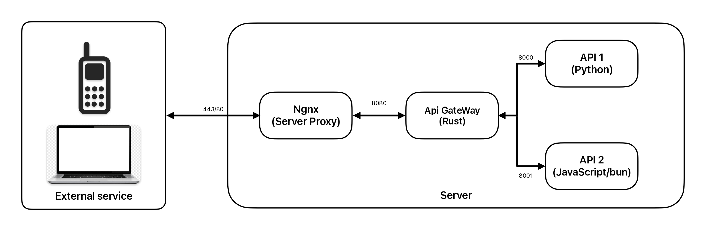

# **Api Gateway**

## Abstract

An ApiGateway is a traffic management service that provides access between micro service layer and external clients. This repository aims to provide an example of `how to use`  Rust (with Actix and reqwst) as ApiGateway. The methodology used is consider and server proxy to load a security ssl configuration, after the load must go to the ApiGateway, depending of the prefix route `/prefix` may redirect to specific micro service. To simplify the deployment and development The system use docker and specialist docker compose to manage that.

## Table of code

1. [Introduction](#introduction)
2. [Setup](#setup)


## Introduction

A simple schema that the project follow is the next

<p align="center">
  
</p>


Folder strcuture

- cars (javascript/bun)
- users (python/fastapi)
- rust_api (rust api gateway)
- ngnx (server proxy)


## SetUp

```
sudo openssl req -new -newkey rsa:2048 -nodes -keyout tudominio.key -out tudominio.csr
```

> Each component can build using docker, each folder can build separately

> As suggestion, create a network and run the docker container over this network
 


docker-compose up -d --remove-orphans


## References


- Images
    - <a href="https://freepngimg.com/png/86146-icons-mobile-symbol-accessories-phone-computer-logo">Icons Mobile Symbol Accessories Phone Computer Logo from FreePNGImg.com</a>
    


